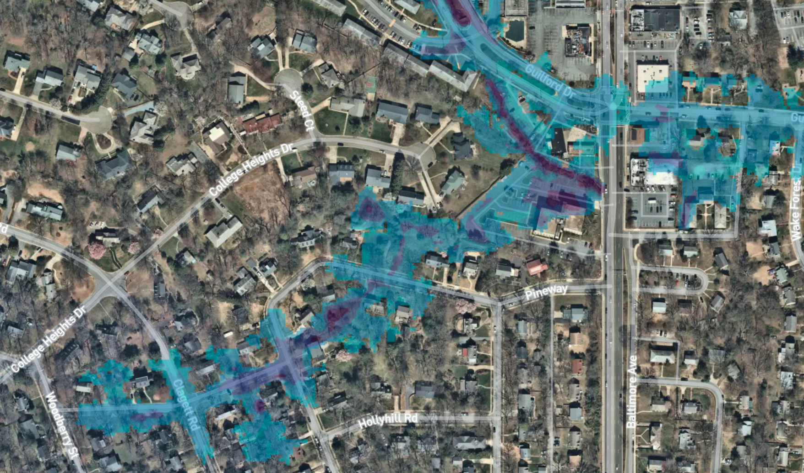
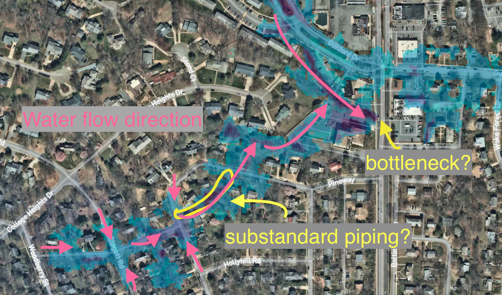

```{r setup, include=FALSE}
knitr::opts_chunk$set(echo = FALSE)
```

# Ward 5 Flooding "Hot Spots"

Ward 5 floods periodically. Not in the "traditional" sense, but because occasionally it rains so hard that the storm drain system cannot keep up. The problem spot is roughly between Pineway (at Clagett-Pineway) through the empty lot near 6924 Pineway, where it heads towards Guilford Run

[Floodfactor.com](https://floodfactor.com/property/6924-pineway-university-park-maryland/241022122_fsid)



# Perspective
While this nice map shows us where the issues are in Ward 5, the surrounding region has FAR WORSE problems (e.g. Riverdale Park below Whole Foods and lower/east Calvert Hills)


# UP Role - April 2021

From a conversation with Len Carey in April 2021, I learned that UP had recently discovered that some of the storm water piping was substandard and not under the control of WSSC. Should the town be able to upgrade the piping, then responsibility of the storm drains can be transferred (town wide?) to WSSC. See the image below for the approximate location of the substandard piping. The storm drain here (Pineway at Clagett-Pineway) regularly drains very slowly under heavy rains. I would imagine that fixing the pipe here would fix this issue.



# Downstream

From my own experience, under VERY (as in 2+ inches/hour) heavy rain events, Guilford Run can get backed up and the storm drains stop taking in water (or perhaps even go backwards....). This is likely because the pipe underneath Baltimore isn't large enough. For the Ward 5 storm flooding issues to be aleviated, this also would need to be addressed (I assume with a Guilford Run holding tank and/or better flow underneath Route 1).

## 2021 05 Update
Thanks for Carter for pointing this [document / plan](https://www.collegeparkmd.gov/DocumentCenter/View/976/Calvert-Hills-Drainage-Improvement-Project-Presentation-October-24-2018?bidId=) out. There has been a great deal of planning to deal with Guilford Run -> Calvert Hills already. With a fair amount of money spent, according to this document. However, the bulk of the project remains to be done.


I'm not certain at what level (College Park / PG County / Higher?) this is being run at. I also need to figure out what the current status of the project is. Should "they" move this more to completion, it would benefit the Pineway/Ward 5 stretch. 

