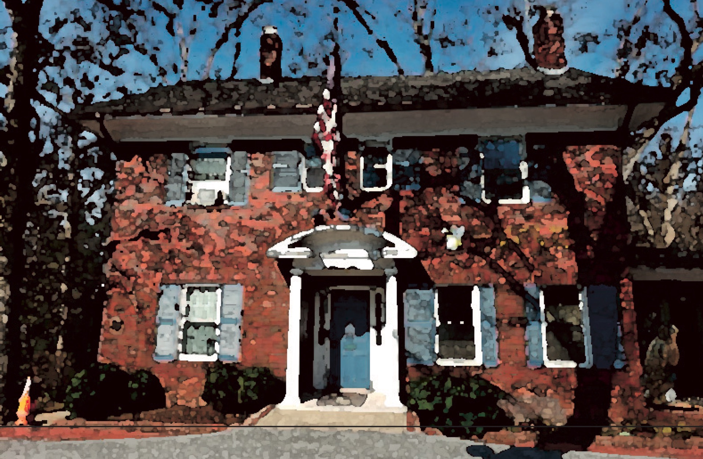
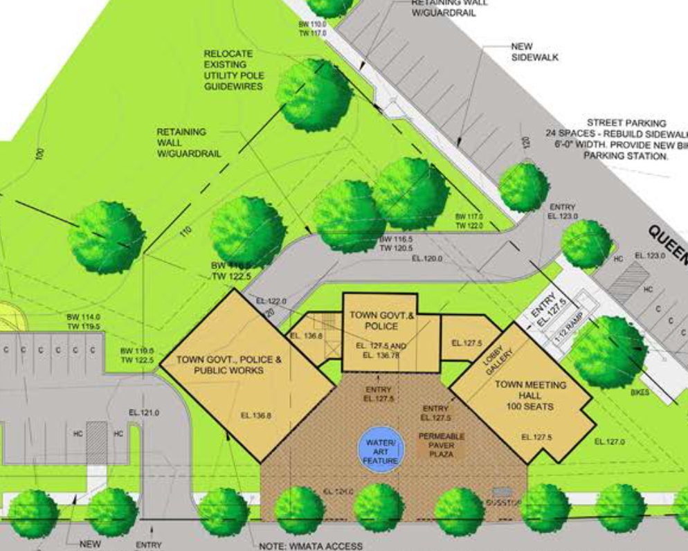
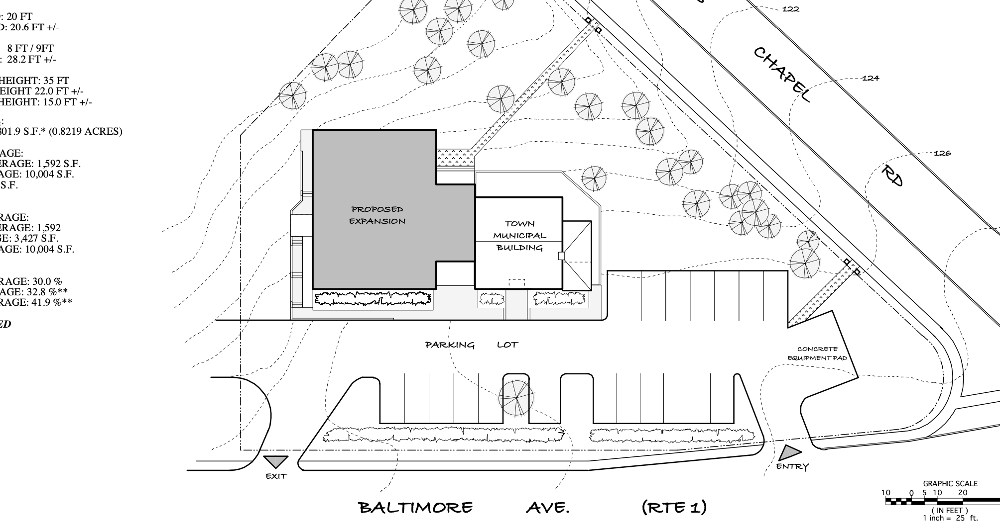
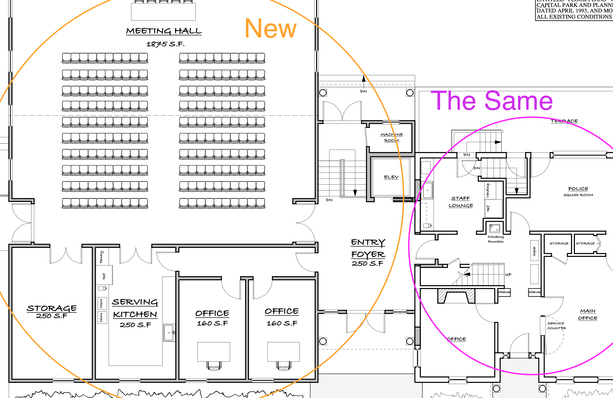

```{r setup, include=FALSE}
knitr::opts_chunk$set(echo = FALSE)
```

# Town Hall



UP's Town Hall is not in great shape. Need to get a tour from Mr. Beall to see for myself. As I understand there is no ADA accessibility, mold issues, and insufficient space for the public works employees. The lot that the building is on is challenging to work with as it is not flat and the metro system has a tunnel running underneath it. 

# 2019

The town council in 2019 commissioned a town hall renovation study from Arnold & Arnold. You can read it [here](https://www.upmd.org/DocumentCenter/View/1383/Final-Town-Hall-Needs-Assessment-Report). The price is ... a lot. 4.2 - 4.7 is more than our yearly budget. Now, that is *not how things are paid for* (UP would likely take out a 30 year bond), but still. That is a lot of money. My understanding is that the public works committee is essentially starting over on the project as the needs have changed with the pandemic. 

# 2009

John Tabori mentioned to me that in 2009 he commissioned a town hall renovation report from Ahman. From his memory he thought it would have cost about 2.4 million. Which had to be shelved as the 2008 recession disappeared all of the grant money the town was expecting. I'm currently (2021-05-10) trying to get access to this study.

... later that day ...

Andrea found the reports. [Here](2009 Town Hall Expansion and Space Usage Study.pdf) and [here](2009 Town Hall Study EBD 0-4.pdf) are the two PDFs she tracked down. 

Dramatically oversimplifying the two (2009 and 2019) studies, I would say that the scope increased from 2009 to 2019. The 2009 plan essentially leaves the original building layout the same (but presumably fixed it up?), builds a small "transition" section whose purpose is to 1. hold an elevator to reach the second floor of the original Town Hall and 2. connect to the new building. The new building is a one story structure that holds a 1. large meeting room, 2. two offices, and 3. a kitchen. 

The 2019 plan involves *two* new buildings. Obviously costs from 2009 won't match 2019, but the extra building (and increased footprint) very roughly increases the building cost by one million *and* the property grading work by another million. Hence 2009 is approximately $2.3 and 2019 is approximately $4.5 million. 

## 2019 Concept 1, Option A


## 2009 





(There's no equivalent to the image above in the 2019 study)

