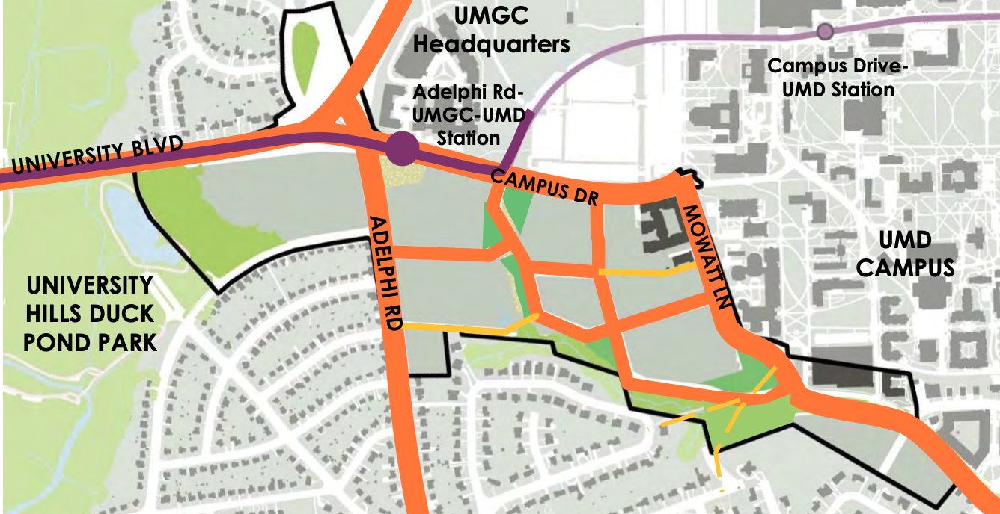
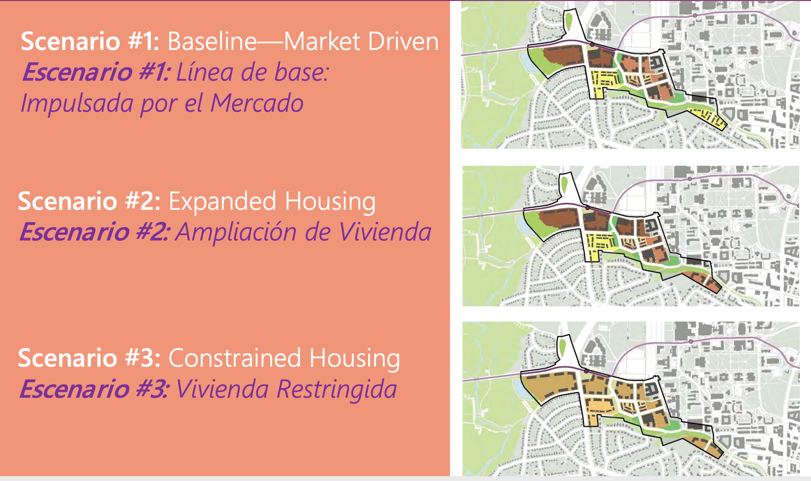
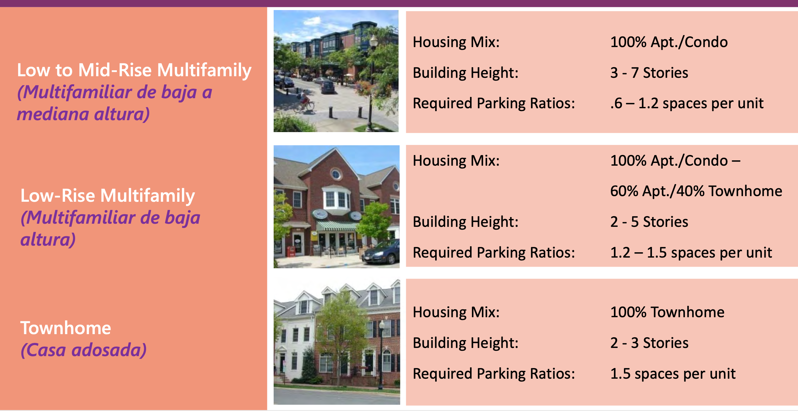

```{r setup, include=FALSE}
knitr::opts_chunk$set(echo = FALSE)
```

# August 2021 Update 

Adding some relevant links. The next UP Developmental Overview Committee should be discussing this matter in more detail to formulate the town's response. 

More links:

   - [UMD](https://adminvp.umd.edu/current-projects/western-gateway)
   - [Gilbane (Developer)](https://www.gilbaneco.com/development/projects/western-gateway/)
   - [Diamondback](https://dbknews.com/2021/06/17/guilford-woods-umd-college-park-affordable-housing-environment/)
   - [Maryland Matters (1/2)](https://www.marylandmatters.org/2021/04/27/one-small-patch-of-woods-near-the-university-of-maryland-sparks-an-epic-fight/)
   - [Maryland Matters (2/2)](https://www.marylandmatters.org/2021/04/28/wooded-parcel-near-umd-inspires-a-wish-list-that-cant-be-fulfilled/)
   - [Save Guilford Woods](https://saveguilfordwoods.wordpress.com)

# UP 

Site info: 

https://arsp.konveio.com/presentation-virtual-community-scenario-planning-workshop-meeting-june-3-2021

Scale: 

  - 2600 units
  - 19,000 sq ft retail (the median grocery store is 40,000 *alone*)
  - 25,000 sq ft office 

Goals:

1. "Maximize preservation of existing trees"
2. "Encourage on-site/shared stormwater management systems."
3. "Create new passive/active open spaces, including a Neighborhood Amenity Square at the station"
4. "Concentrate tallest buildings along Campus Drive/Mowatt Lane" (away from UP/CHE)
5. "Expand bicycle/pedestrian/stormwater management/street trees along new & existing streets"
6. "Recommend expansion of buffers from existing houses" 
7. "Reduce required and recommended parking to encourage walking/biking/transit use"
8. "Implement a phasing plan: core to edges"
9. "Understand Graduate Hills and St. Marks Church may not redevelop for 20+ years."







# Good news

1. They will retain the trees around the stream in all plans
2. They, generally, propose townhouses (that are "stepped in" - one story on the CHE side) that abut CHE
3. The goals are laudable ("Maximize preservation of existing trees", "on site stormwater", "expand bicycle/pedestrian")

# Bad news

1. No discussion of stormwater management
2. No details on the tree preservation in the "passive parks." Are they pruning trees? Will they cut some down? Will it literally be left alone? 
3. No details on what the pedestrian / biking links will be. It's a goal....but no information. 
4. Little retail means you have to involve a car to get groceries
5. No intersection improvements at University / 193 / Adelphi. It's already a nightmare and now a light rail and 4000 people are going to be added. I don't know what the solution is, but *do nothing* doesn't seem like a good idea.
6. Schools were not mentioned....presumably *some* familes will be moving here? 
7. No "active" recreation space (tennis courts, etc.)

# Town response
Ward 6 CM Martha Wells drafted a response that Mayor Carey sent to the Maryland-National Capital Park and Planning Commission. I have a copy of it, but have not seen the "formal" one posted on the [UPMD.org](upmd.org) page yet.


