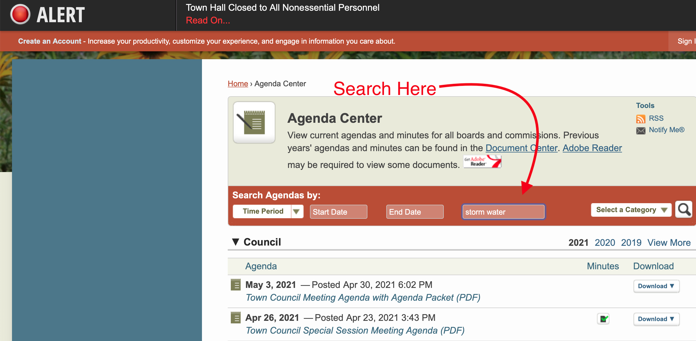
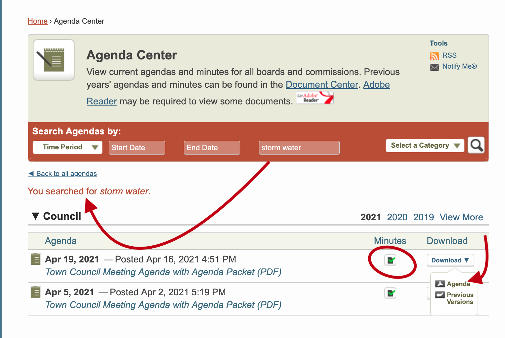

```{r setup, include=FALSE}
knitr::opts_chunk$set(echo = FALSE)
```

The [upmd.org](https://www.upmd.org) web page is a great resource for getting a wide variety of town info. There is an extensive amount of public discourse about what the town is doing, will do, and would like to do. This happens at the town meetings. 

Importantly, the notes for the meetings are **TEXT SEARCHABLE**.

The town meetings are of two basic types: [town council](https://www.upmd.org/198/Town-Council) (1st and 3rd Mondays of each month, beginning at 7:30pm) and [committees](https://www.upmd.org/185/Committees-Commissions) (each with their own schedule, often monthly). **All of these meetings are fully open to the public** and as of May 2021 are held exclusively via zoom teleconference. 

# A case study

To give an example of how to search the town web page to find information on what the town is doing, we will search the term "storm water."



In the search box you can put in a word or phrase ("storm water"). Then click the magnifying glass (or hit "return" on the keyboard) and you will get the time sorted results, split by section (where section is the specific committee or the town council).


We see the top three hits (by date) are in the Town Council Meeting and the Development Overview Committee. You can then download either the Agenda (what *will* be discussed) or the Minutes (a summary of what *was* discussed).

If we download the Mar 11, 2021 minutes we see that the "Aspen, College Park" development has a preliminary plan of subdivision that has been approved and "Nick Speech talked about the re-engineering of the project’s stormwater handling. The County will not accept a fee in-lieu for stormwater management. They have included vaults to hold stormwater under each of the 2 buildings..."


