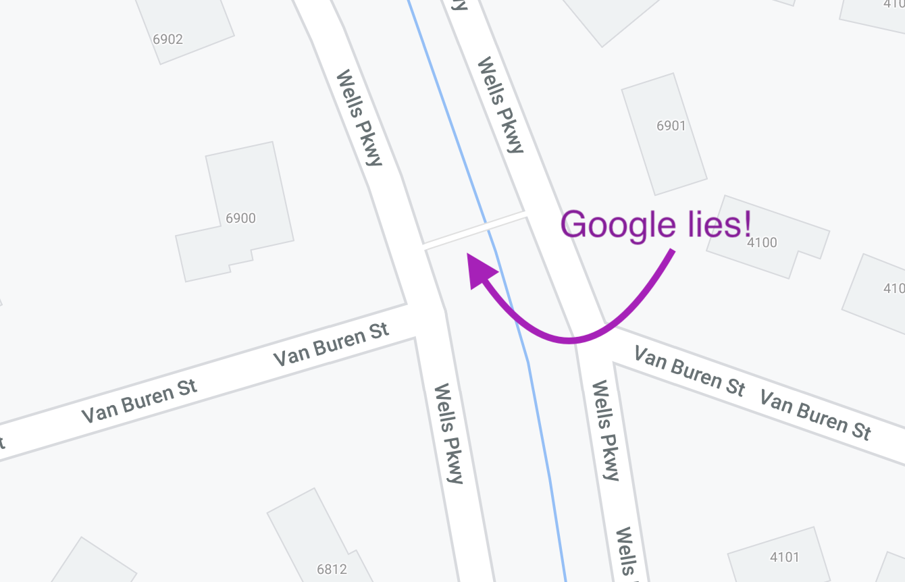

```{r setup, include=FALSE}
knitr::opts_chunk$set(echo = FALSE)
```

Brief stub to explain the current state of the Van Buren / Wells Parkway Pedestrian Bridge. Which Google Maps thinks is doing just fine.



From my faulty memory, around 2016 (????) it was pointed out that this bridge was in bad shape. This was confirmed by engineers. In fact, it was in such bad shape there was concern it could collapse. Thus, it was removed.

Periodically people (like me) ask "uh, where's the replacement bridge?" 

Here, I will explain what I understand about this annoying situation.

1. The town bought two wooden bridges. We have them on hand.
2. Permitting was required at three levels (Federal, State, and County). The latter was extremely challenging (apparently the bridges were missed in the 1990s era PG County Master Plan).
3. After huge amounts of town staff time dealing with the three layers of permitting, the town bid the bridge install out. It came out substantially higher (around $110,000) than expected. The council, twice, voted it down. 

So the bridge replacement process is currently ... in bad shape. Maybe even dead. 

Part of the reason that the install was so expensive was the extensive amount of work required to not cause sediment and erosion issues in the stream bed. 

With all we have learned, we may have to restart the entire process (including the part where we buy some bridges). A longer / larger bridge may cost more, but could save money on the install cost.


