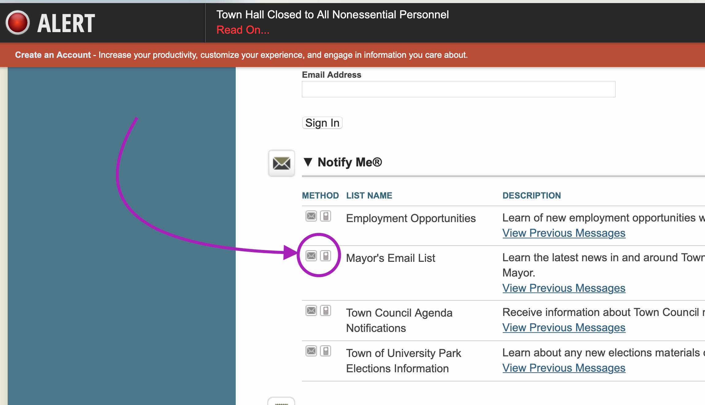
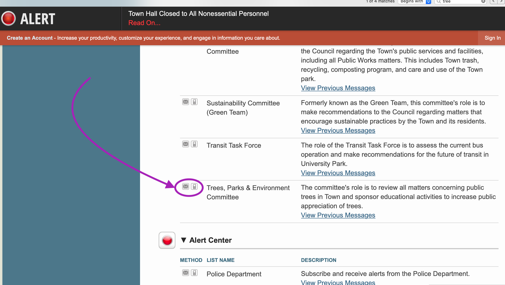

```{r setup, include=FALSE}
knitr::opts_chunk$set(echo = FALSE)
```

Our Town Clerk is Andrea. She told me she was hoping more town residents would sign up on the web page to get updates. I think she is right. Why should you? After all, the town writes and prints a newsletter that comes to your mailbox!

Well - one important reason: time. The newsletter comes out once a month. Minutes of the town meetings that go into the newsletter have to be approved by the council. Then meet the printing cutoff. So essentially you are reading minutes ("what happened in the room") that are *4-8* weeks old. 

If you want to get council matter updates MUCH faster you can go here: https://www.upmd.org/list.aspx

I suggest you sign up for the "Mayor's Email List" as Mayor Carey generally sends out a Friday-before-the-Monday-Council-Meeting message that briefly covers what will be discussed at the upcoming meeting. There is always a public comment period near the start of the meeting (7:30 pm) to allow residents to have up to 3 minutes to give their opinion. 



If you have more *specific* interests (for example "trees") - you can sign up for Agenda updates for a specific committee like the "Trees, Parks, & Environment Committee".


If you want to influence legislation the best time to do it is **at the Committee level**. By the time a piece of legislation has made its way to the full Town Council the specific committee generally believes it is ready to be approved (otherwise why bother bringing it out?). So thus raising issues *before* it gets to the full Town Council will be more effective. 

Remember, **all** council meetings (either Committee or Council) are open to the public. You **do not need to ask permission to show up**. Depending on the specific Committee you can either take part in the full discussion or will be limited to speaking in the "public comment" portion of the meeting.


