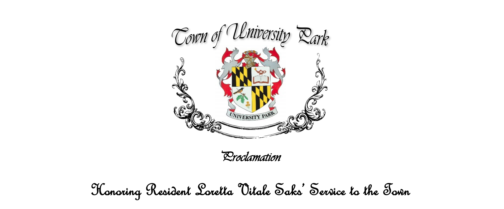

Incomplete, possibly inaccurate notes on what happened. Not official. 

  - Gas blower ban: Continuation (delay) for 2 months for the [Policy, Rules & Municipal Structure Committee](https://www.upmd.org/191/Policy-Rules-Municipal-Structure-Committ) to make some changes. At the September 7th Town Council meeting the ordinance will (likely) come up for a vote. If you care about improving the ordinance, I suggest you attend the [August 5th Policy, Rules & Municipal Structure Committee meeting](https://md-universitypark.civicplus.com/Calendar.aspx?EID=1281&month=8&year=2021&day=7&calType=0).  

  - I will be serving on the [Public Facilities and Services Committee](https://www.upmd.org/192/Public-Facilities-Services-Committee) (e.g. town hall renovation) and the [Police, Traffic and Public Safety Committee](https://www.upmd.org/190/Police-Traffic-Public-Safety-Committee).

  - Loretta Vitale Saks was formally honored for her role in establishing and running the Helping Hands University Park special committee. Linda Verrill will take over as chair of the committee, as Ms. Saks will be leaving UP soon. 
  
  - The "Infrastructure 2B" walk through was briefly discussed by myself. New sidewalks being added on College Heights Dr, Clagett, Claggett-Pineway (and other roads off of College Heights Dr). Notably the roads will be narrowed to 26 ft. While not ideal, sidewalks will generally be right next to the road to reduce the number of utility poles that need to be moved and to protect mature trees. While **not** discussed the "far" side of Clagett-Pineway (closer to College Heights Dr) will likely be narrowed to 24 ft and parking removed from one side to reduce the amount of yard that will be taken, as this portion of Claggett-Pineway is **already** 26 ft. 
  
  

  - The town will be hosting the first ["Meadow Day"](https://www.upmd.org/calendar.aspx?eid=1403) on July 24th!
