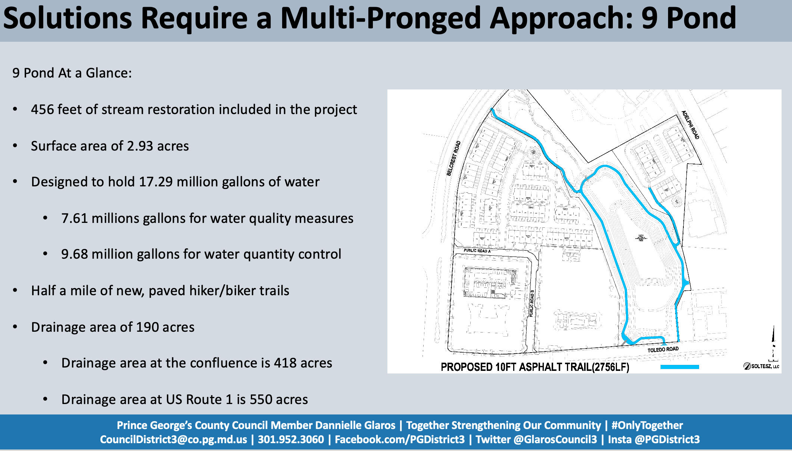

# Danielle Glaros presented on storm water projects:

PG county has challenging topography for flooding because:

1. Poor drainage 
2. Low lying 
3. Waterways everywhere

Because of this, PG county has *stronger* storm water management than the state of MD requires. Essentially every new development needs to control 100% of the run off. The MD standard is 50%. However, older developments have zero storm water management.

One interesting nugget was that because of these strong regulations new developments **reduce** the amount of run-off downstream. 

UP has two waterways:

1. Wells Run
2. Guilford Run

She focused mostly on Wells Run. The 9 Ponds project will likely start within 6 months. Will take about a year to complete. Will be a pond with a path around it. Goal is to make a desireable amenity. Unfortunately trees will be removed to make the pond (designed to retain as many as possible and to replant new ones). The creek upstream of the pond will also be cleaned up to improved flow. Half of water than runs through UP / Wells comes from the PG Mall.Hopefully this will have a large impact for UP.

Guilford Run has some storm water drain work to be done downstream of UP (east of Baltimore). 

Ms. Glaros emphasized that water management needed to be managed where it was created. There are no magic bullets. We have to work to control the water we have with rain gardens, reducing impervious surfaces, etc. 

She is introducing legislation to increase the amount of money the county will reimburse for on-property water control (rain barrels, rain gardens, pervious pavers, etc.). 

# American Rescue Plan
The town of UP will receive approximately \$2.1 million from the US Government over the next two years. The first million will be received very soon. While this is *free* money it has restrictions on how it can be spent. Very briefly, it can be spent on climate change mitigation (storm water), broadband investments (internet), and COVID-19 mitigation (food banks / small business loans). The town (and committees) are still formulating how the money will be spent. Most of the money will likely go to storm water mitigation. The mayor of UP is looking into hiring a consultant to make a comprehensive Wells Run Watershed (which includes Hyattsville, UP, and Riverdale Park) storm water management plan. The money must be allocated for a project by 12/31/2024 and spent by 12/31/2026. 

# We bought a garage
The town of UP is buying the garage that we have leased for the past 11 years. Why? Three reasons:

1. The owner is selling it
2. We are unable to find an equivalent garage within a 20 minute (or even longer....) drive. Much effort was spent trying to "share" garage space with neighboring towns with little effect. The town is a touch salty because we thought we had a deal with Hyattsville....then the terms were changed. 
3. We **need** a garage to fix and store our town equipment (there is a reason you don't see garbage trucks parked at town hall....)

The town administrator (David Deutsch) and the town lawyer (Suellen Ferguson) have been negotiating for months. We have a deal at \$825,000. $450,000 was allocated in the last budget for this expense. The remainder will be paid using American Rescue Plan funds, as apparently this is an allowed use of the money. 

This is good news because:

1. We **control** a very important piece of infrastructure (a medium-sized garage) that is getting increasingly difficult to procure with the continuous development in the area. We literally were unable to find another equivalent garage (size / location / cost) for lease or sale. 
2. We paid "cash" for it and this now frees up about $42,000 / year for the town that was going to the lease.
3. We can always sell it should our needs change 
4. Our inspections reveal no pollution or structural issues, aside from a leaking roof

# Town Head Notes
Andrea (town clerk) would **really** like more town residents to sign up for relevant alerts (e.g. "News and Announcement"). I wrote why you should sign up [here](https://davemcg.com/ward5/notes/2021-05-20-signingup/).

Dan (Treasurer) briefly summarized the 2020 spending (fiscal year ended 6/31). 

Mickey (Public Works) said that the two storm water mini projects (permeable paving at 44th (?) and a rain garden at Claggett/College Heights) were looking great because *either* one would be enough to meet our PG County requirements. We could save money by doing one or do both and bank extra storm water credits.

Chief Baker had no crime to report. Thanks were given for the UP Town Police's (and Park Police with their horses) role in the July 4th parade. 

