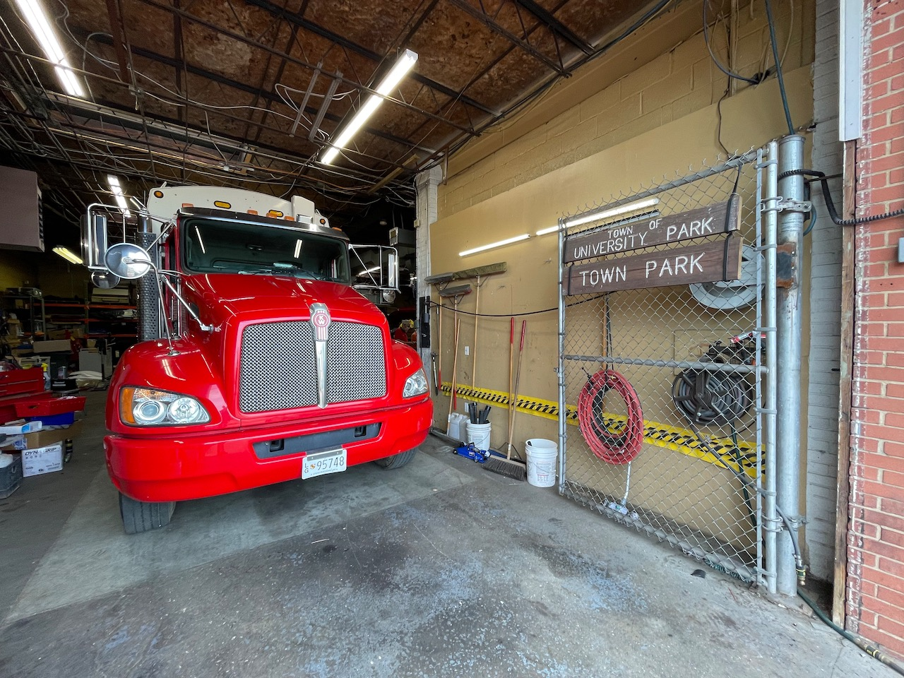
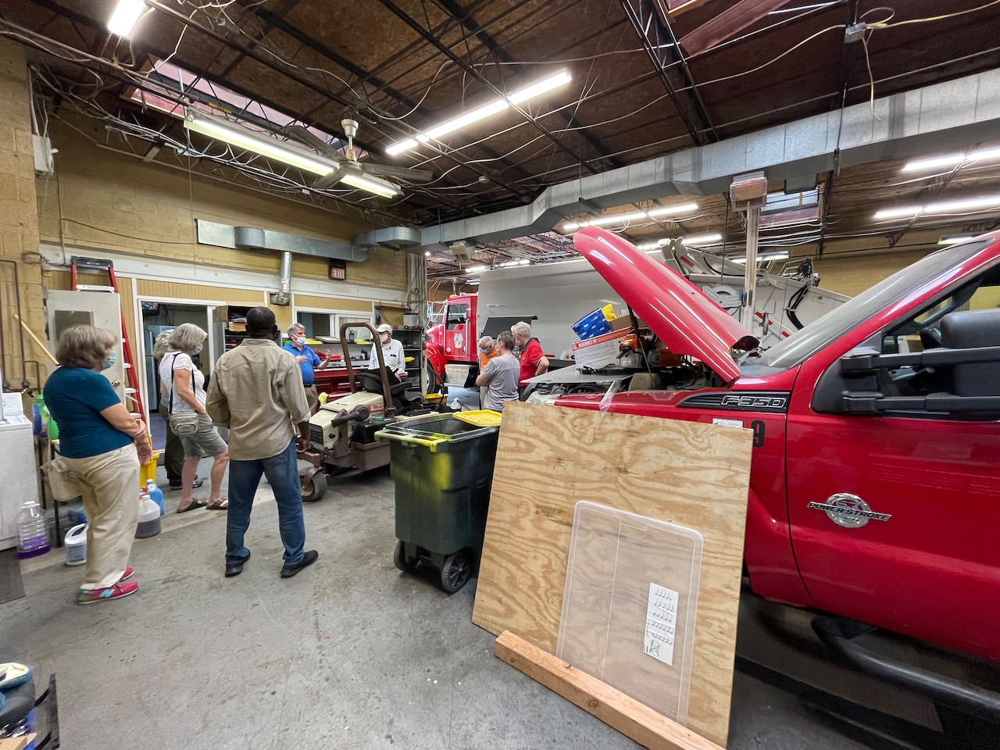
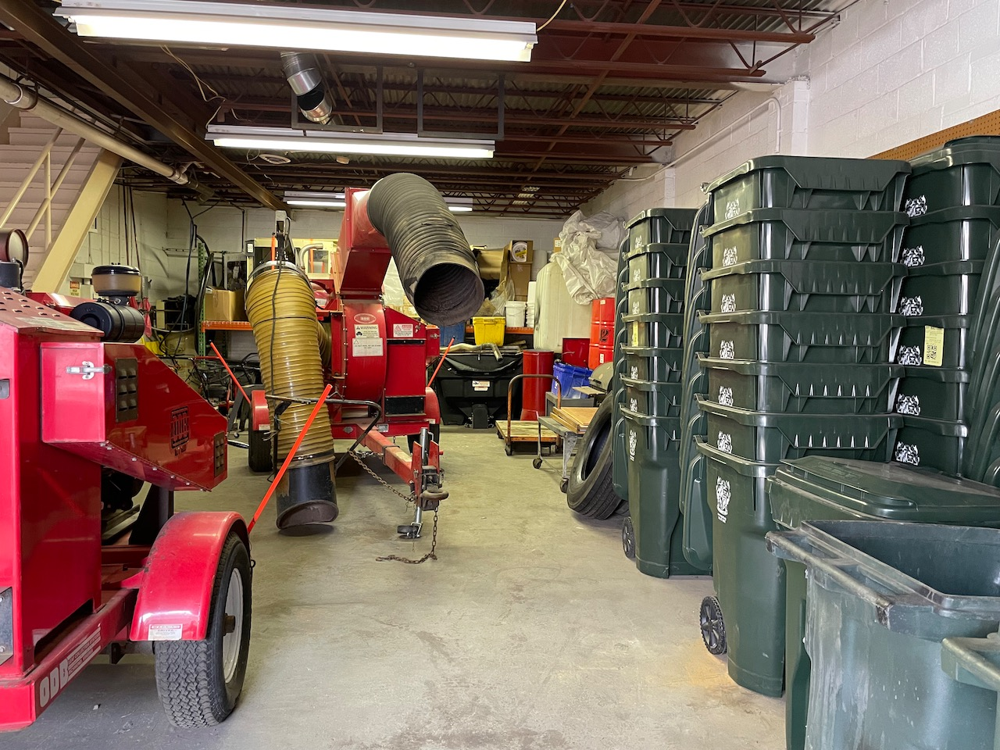
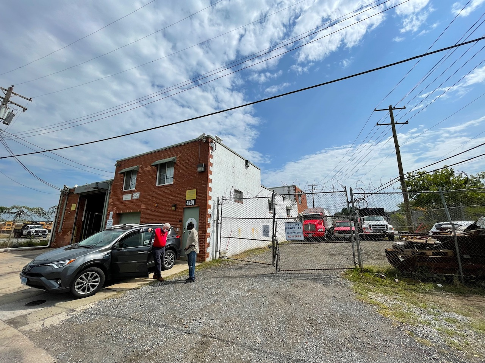

```{r setup, include=FALSE}
knitr::opts_chunk$set(echo = FALSE)
```

# Our New Garage



4201 48th Street, Bladensburg, MD

One large bay. Enough space for a garbage truck *and* a pickup truck / car to be worked on simultaneously. Though if the main bay is in use (as it is below), then that red pickup is stuck until the garbage trucks is moved.



~4000 square feet (sq ft) of interior space.

~1500 sq ft of exterior space

The town *was* paying about \$37,000 / year. When the long term lease ended (late 2020/early 2021?) the rate went up to about \$44,000 / year. The town also paid the utilities. 

# Rough timeline. 

Rougher because the process began before I was a councilmember. 

1. Late 2020/Early 2021, the town is informed that the 4201 48th Street garage that UP has been renting for the past ten years will not be available for another lease as the owner plans on selling the property. 
2. In March 2021 the council is presented other options. The town of Hyattsville offers up their old garage. At about *double* our current rate for our existing garage *and* only offers a short-term lease. Two sites in College Park are modestly larger than the current site, but about 2.5X our current cost. One is substantially smaller and about the same price as we currently pay. The owner of our existing garage informs the town the will sell in about September on the open market, as for \$995,000.
3. The town begins an exclusive (one on one) negotiation with the owner of the 4201 48th Street garage
4. In a closed session (June?) we (Mayor and council) are told that the town continues to look for alternative sites (for sale or rent) and has been negotiating back and forth. No good alternatives (within the price/size/distance constrains) have been found. The council urges the administration to work on back up plans should the negotiations fail.
5. A few weeks later we are informed a deal has been reached at $825,000. 
6. The town is notified in the Town Council meeting and with a flyer about the impending purchase.
7. We learn that we can use American Rescue Plan funds to pay for approximately \$375,000 of the cost, meaning no mortage needed to be taken out. The town had already (last fiscal year) allocated \$450,000 for the potential purchase.

# So why are we buying it?

1. UP has "in-sourced" the public works operations
2. We own our garage trucks. The garbage trucks are operated **and** maintained by town staff, including our own mechanic. 
3. This **requires** a garage to maintain / fix our town equipment and the site also serves to store supplies and equipment (the garbage trucks, replacement trash cans, the leaf suckers, extra street signs, etc).
4. This is our best option, buy or rent. 



# Why don't we just out source the maintenance?

Well, then we would be reliant on someone else to fix our stuff. In practice our Public Works Director (Michael "Mickey" Beall) has said this means that it can take days / weeks to get repairs done. Which means that the town would have to **buy more** garbage trucks / etc to cover the extra down time and thus require even *more* space to store the equipment. Our mechanic works full time to maintain all the town (including the police department) vehicles and equipment. 

# Is this is a bad deal?

It doesn't seem like a fabulous deal. I don't understand the commercial market. We were told that the recent jump in home prices has been matched by the commercial market. Mickey told me he thought this garage was a useful size for many businesses and he wouldn't expect it be difficult to sell the garage, should the town ever go in a different direction. In the end, this was the best choice available. The good news is that that we used a restricted pot of money to partially pay for it. We also control the site now, so there is reduced risk of "surprise" expenses (remember if we were to rent a different garage our best options looked like they would double our cost). The site has been inspected. The building (except maybe roof) is in good condition. Long term, I think this is a good move. The town is full-in on running the public works in-house and a garage is a core component of that approach.


