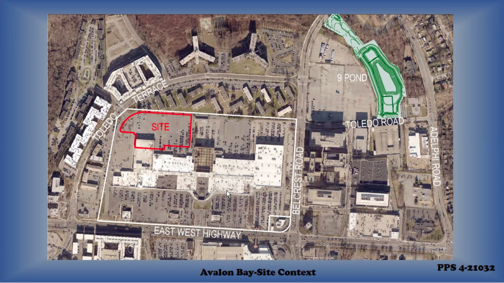

# 2022-03-07 Town Council

## Mayor Notes:
  - 3/30 the Hyattsville Library ribbon cutting!

  - UPCA is alive and is seeking event chairs and a president

  - 4/2 is the UPCA Yard Sale

  - Mayor has asked staff to open Town Hall to the public in the Spring.
  
  - In person council meetings with Zoom? Probably would happen with the incoming Mayor. Town Attorney Ferguson points out we can’t use the 2nd floor of town hall as not ADA compliant (Zoom doesn’t count).
  
## Biermann Notes:

  - Sustainability committee looking into making UP:
    - Monarch Waystation
    - Bee City
    - More pollinator spaces
    - Advertising “No Mow May”

  - April 23rd: 10am Town Stream Clean (Town Field)
  - June 25th: Meadow Day 10-12
  - Town Park Plan RFP: Make a timeline to finish comments

## Mickey Beall:

  He explains why the council should allocate another **$300,000** or so to finish the town infrastructure project.
  
  Permitting is getting crazy slow (my words, not his). Was supposed to get October 2021 to finish "Phase 2B" and … we are still waiting. 
  
  The project was budgeted for 3 years ago … and as the permitting / etc has gone so slowly the costs have increased substantially
    
  - Also expanded scope of sidewalk repair to take advantage (~ 350 homes) of cheaper original pricing 
    - every sidewalk issue of note has been repaired
    
  In the end … the \$2.6 million dollar project (original budget) is now \$2.9 million. So there is a $329,292 overage from the original allocation from 3 years ago. Mickey recommend we finish the work.
    
  - about 100,000 is from doing extra work (fixing more trip hazard sidewalks) 
  - about 200,000 is from increased costs (inflation, essentially)
  
  The town will likely use our reserve to pay for the overage
  
  Bridge (near UP Elementary: It has 10 years of deferred repairs….so Mickey thinks this is important we should get it done (this alone is around \$100,000 - this was originally put in the \$2.6 repair budget. I just note this as it is a fairly expensive item.)
  
  The council passed this request 6-0. Yes, paying more is highly annoying, especially as a lot of the fault seems to lie with the county level permitting process being slow. But given the rampant inflation we are living through, this is (in my opinion), a not-crazy cost overage. These repairs will put the town in a good position over the next decade or so, I hope. 
  
# Public Safety Subcommittee Meeting (2021-03-09)

Just some quick costs that Mickey gave for various road "features." Useful numbers to have in mind when thinking about requesting improvement:

  - 14000 for a table top sidewalk
  - 3500 speed bump
  - 1000 blinking stop sign
  - 5000 blinking speed sign
  - 8000 blinking crosswalk (example in front of UP Elementary)
  - 80 stop bar (the white line at each stop sign) 
  
We on the public safety committee will ask the full town council to adopt a *town wide* 20 mph speed limit. 

# DOC (2021-03-10)

JC Penny at PG Plaza Mall getting turned into an apartment. Will also extend Toledo Road through to Toledo Terrace (when you cross into the mall it isn't really a road....just a mall parking lot exterior lane thing). I asked the committee to recommend that the full town council formally ask for protected bike lanes as they were proposing just putting some paint on the road for a bike lane. As they are rebuilding Toledo, it seems like a missed opportunity. We are also going to ask to get more details on storm water management (their engineer was not on the call). 
