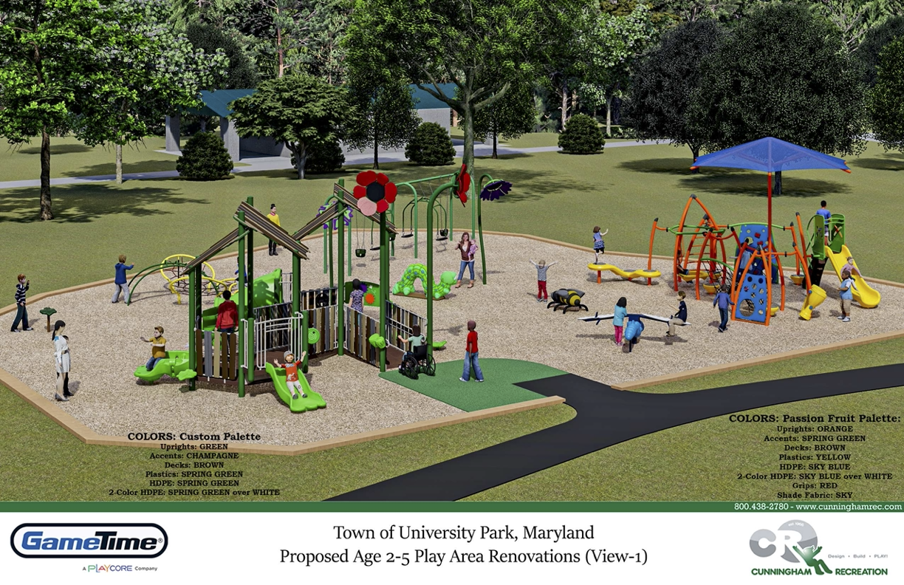

# Stormwater

## Two tracks

1. RKK (engineering firm) has been tasked with designing a *town wide* stormwater management approach. We have been about a month away from seeing the final report for what feels like several months now. Hoping to see this soon! The town suggested a list of 8-10 sites / ideas to spur the process. Overall they were asked to suggest and price solutions which will make the town more resilient to the increasingly violent rain storms which are causing the streams (and streets) to flood. 

2. Update existing systems (Soltesz). The town contains several stormwater system elemetns that are “below standards.” The town is currently working with the Soltesz engineering firm to propose a updates to make all of our town systems up to standard. I’ve been in communication with most of the households in Ward 5 that this work directly effects. The hope is that after we upgrade the pipes underneath Clagett-Pineway we will be better prepared to handle the more frequent 3-inches-in-30-minute microbursts we are getting. This was supposed to be done last week, but has been delayed a bit (hopefully done this week???) due to some COVID in the Soltesz staff.

# Tot Lot

Budget approved. Design finalized. Looks pretty nice I think. Mayor Bierman set up a parent-led committee to help design the new tot lot. The existing equipment will be offered to the University Park Elementary School. This is the design, but not the color scheme. 

# Town Administrator

Mr. Deutsch let the mayor know he intends to step down by the end of this year. He has offered to help recruit and hire the next administrator to make a smooth transition. I expect (assume? guess?) that Mayor Biermann will lead the search and interview process. 

# Phase 2B

At the last council meeting the council approved funding changes (had to spend a bit more due to the huge delay in starting this project). Construction may begin in a few months.

This will add sidewalks on the south side of Claggett-Pineway. This will narrow the roadway - enough that the “West” portion will switch to one-side only parking. 

# Drug take back

This Saturday (10/29) at Town Hall.

# Permitting Change

For "standard" permits, town council approval is no longer needed. This means permits will be approved on a quicker timeline. Anything requiring a variance will still need council approval. 

# Halloween

The UP Police are closing many roads this year to encourage walking:

	- Wells Parkway (Chansory)
	- Van Buren (Forest Hill)
	- College Heights (Forest Hill)
	- College Heights (Underwood)
	- Wells Parkway (College Heights)
