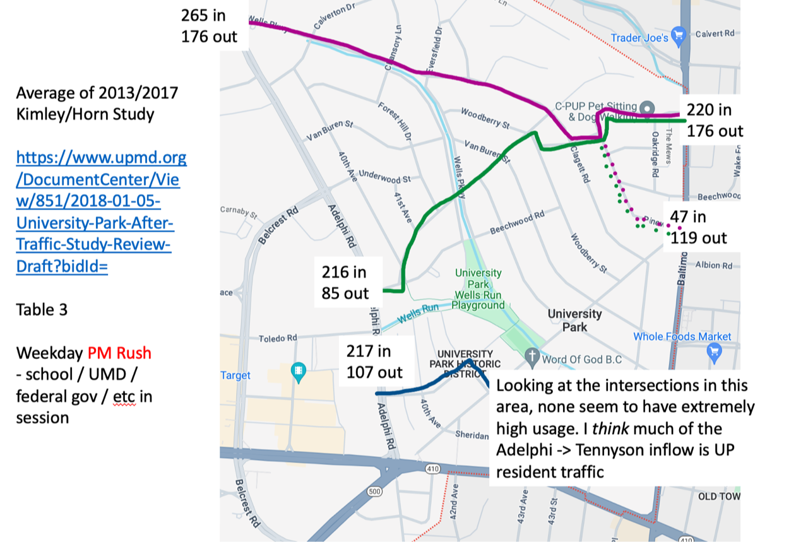

# Traffic Analysis of 2018 Kimley Report

Residents on the North Pineway "bend" (near Clagett-Pineway) signed a petition requesting another speed hump and investigation as to better managing the traffic volume. The town installed a temporary speed hump to augment the existing ones (which as a resident pointed out and Public Works Director Mickey Beall confirmed) were not the proper shape (they are too "deep" as the design was intended for a raised crosswalk). 

The next bit is a bit harder to figure out. The reflexive action is always to order a study. This is useful for several reasons:

1. This punts the problem for at least several months
2. Someone else should solve the problem
3. If/when the proposed solution is bad you can just blame the engineer/consulting company

As I get more time on the council, I'm trying to be more precise. The interim town administrator and the Chief found a Chevy Chase consulting report which was designed to find solutions for high amounts of "cut through" traffic in Chevy Chase. In short, the report alone cost about $60,000 and recommended three things: 20mph speed limit everywhere, more scary signs, and have time delimited entry on certain exterior roads. So that gives us a good idea of what a firm would recommend to us - road closures.

There is also 2018 [Kimley traffic report](https://www.upmd.org/DocumentCenter/View/851/2018-01-05-University-Park-After-Traffic-Study-Review-Draft?bidld=) commissioned by then-Mayor Len Carey on the recommendation of the public safety committee. I think Joe Schulz was the chair at the time. The study measured traffic on "normal" weekday evenings and compared 2013/2017. Normal being that school is in session and there are no holidays. The traffic counting confirms the following:

1. There is substantial inflow and outflow of traffic at two points in town: 
  - Adelphi/Wells
  - Baltimore/North Pineway
2. There is also substantial inflow at two spots:
  - Adelphi/Beechwood
  - Adelphi/Tennyson
3. The Adelphi/Beechwood inflow of traffic appears to be flowing towards Clagett Pineway
4. The Adelphi/Tennyson inflow of traffic appears to be mostly internal UP traffic as none of the other traffic monitors in that area have particularly high counts.
5. There is a surprising amount of outflow traffic at Baltimore/South Pineway

Here's a infographic of how I interpret the data.

It's impossible to know from these studies precisely how much of the this traffic is "cut through." I am defining cut through as traffic that starts from outside of town/College Height Estates (CHE) and ends outside of town/CHE. As a resident of North Pineway, I'm pretty annoyed watching 2 cars / minute go by my house for hours - but I do recognize that a substantial fraction of these cars are people living in town (and CHE). 

If (*IF*) we get another study, I think it would be useful to inquire into whether historical cell phone (gps) based databases can be queried to determine regional flows of traffic (e.g. is there substantial mall -> UP -> Whole Foods flow?). We should also get count information in the morning rush hours.

We (as in you the resident and us the council) also have to consider how far we are willing to go to "attack" cut through flow. Solutions would likely include disruptive elements like temporary(?) (time-of-day limited) road closures or one-ways. If there were easy solutions, we would have already done them. Now we are left with more difficult choices.

I think we should only consider solutions that reduce the amount of *total vehicle trips within UP/CHE*. We should be wary of proposals that merely move car traffic from one road in town to another road in town.

I've been told the Chief is purchasing more sensors to capture traffic information. We do have the "blinking speed signs" but those are less useful for capturing speed information as the sign itself slows down traffic.

# Parking Control

The Chief continues to recommend we implement parking restrictions in Ward 5 (in the North Pineway / Baltimore area) and Ward 6 (near Adelphi) as the police are regularly finding non-resident parking happening here. The nuts and bolts have been mostly worked out as the police / staff have implemented a small controlled parking zone on Wells Parkway last year.

How it (roughly) works:

1. You show up to town hall with proof of vehicle(s) ownership (registration and license perhaps? I'll get more information on this) and get a parking placard to hang on your rear-view mirror.
2. You get two parking passes for visitors
3. If you are having a party / event you can email the police and request that parking not be enforced for a certain amount of time. 

I'd love to have your thoughts on this matter! It obviously makes it a bit more annoying if your street becomes a controlled parking area. I don't think any extra staff hiring is required to implement this - enforcement would come from our existing police officers. 

# Town Hall

As a brief reminder here is an incomplete list of what is currently lacking in our town hall:

1. Fully conditioned space (we are using cobbled together window units)
2. Enough power (the building is being strained with the current electrical service)
3. Proper document storage (they are jammed in an attic)
4. Adequate locker and shower space. The Public Works and Police are sharing an overly-damp basement. We don't have separate male/female showers.
5. A town hall meeting space (the only semi-large space is on the second floor, which cannot be used for public meetings as there is no elevator)
6. Dry locker / garage to hold commonly required public works items (bins, small tools).

We recently contracted Frederick Ward (a engineering/architecture firm with experience in designing municipal buildings) to propose a new town hall design. The public facilities committee recently received a preliminary report from them. Very briefly, the previous study (from Arnold and Arnold) recommended a few options in the 4-8 million dollar range. Frederick Ward took information from those previous commissioned studies and is attempting to suggest solutions in the 2 million dollar range by aggressively removing potentially less useful space, using the Bladensburg garage for more roles, and combining functions with the overall goal to reduce square footage. This will be challenging as those 4-8 million dollar quotes came from pre-COVID/pre-inflation times. We have no renderings or even floor layouts, but they are currently suggesting the most cost effective solutions will be to build either an entirely new and separate structure or an addition on the side of the existing town hall. Renovating the existing town hall would cost a surprisingly large sum of money as a single family home from the mid (?) 1900s makes for a lousy town hall in the 21st century. Plus renovating the town hall itself would force all the of the staff to go...well I have no idea where. Some staff could work from home but the police and public works *need* a on-site location. 

The initial Frederick Ward proposal suggests that the entire public works staff be moved to our off-site Bladensburg garage. Unfortunately this garage is very poorly suited for more than a few people working there because:

1. Most of the limited on-site parking is used by the garbage trucks,
2. There are only 2-3 car parking spots we can count on, and
3. Nearby is a PG County School Bus depot, and the street parking is 105% utilized when school is in session.

Mickey also points out that, operationally, it would be very inefficient to have all of the public works staff in Bladensburg. 

I think the next steps will be for the town staff / administrator / Mayor / Frederick Ward to discuss exactly what kind of space is needed (yes, there WILL be a town hall meeting space) and then the town will have to decide on what kind of structural approach (addition / new building) to pursue before we get floor plans. Then once we have floor plans, I think the next step would be to get rough quotes and discuss the proposals with the public. 

Related, the Mayor / Town Administrator recently made a legislative request for \$500,000 to be put towards our new town hall. 

My semi-educated guess is that the initial proposals will range in price from roughly 3-6 million dollars to:

1. Build a new town hall capable of holding all staff (if a bit crammed) and a meeting hall space
2. Leave the existing town hall as-is. After the new town hall is built, modestly renovate the old building for staff office / locker space. 

# Police Camera Monitoring

The Chief very much wants a town wide camera monitoring system. Why?

1. Every other town around us has one. Most businesses, do too (you enter the library or Whole Foods - you are on camera).
2. People with unsavory motives know who has cameras
3. The UP police force is under-staffed (VERY hard to get officers right now) and a camera system would substantially augment their effectiveness.

Price: If I recall correctly something around \$185,000 to set up and about \$12,000 / year. The set up price is about the same as 1.5 police officers for a year. We have been down 1-3 police officers ever since I have been on council.

Privacy comments:

1. No one gets "live" camera feeds
2. The camera system would only monitor *public* areas
3. The camera system is intended to send automated alerts (e.g. "3 persons entering park at Adelphi now, 1:23am")
4. Video snippets are NOT automatically sent, nor can the officers pull up live video
5. Only the Chief / Captain can review past footage (and only under certain circumstances)
6. Footage will be automatically deleted on a schedule of our choice (1 month? 2 months?)
7. Council envisions a system where a separate committee of staff/council/residents can make recommendations on how the camera footage / alerts are to be used.

I am for this - one or two officers cannot oversee the entire town at night. There are persistent vehicular and home thefts. Having real-time information on unusual movements will be helpful in reducing these nuisance crimes. This should make our small police force more effective.

# Town Administrator

Angela Lawrence is our *interim* town administrator. She is also leaving (I believe for full(er) retirement) this summer. Council and Mayor appreciate her hard work and organization across several long-term and important projects. She is preparing materials to start a new town administrator search and we all hope this will attract several high quality candidates. A subcommittee of council members (Gathercole, Morgan, Morrissey) will review the recruitment materials before they are presented to the full council (and public). 

# Stormwater Management

The MOU process still continues. The county recently forced the town to get another, more detailed, "scoping" of the pipes to identify *exactly* the condition of the pipes as they curve from Clagett-Pineway to Pineway (North). This information was just sent back to the town's consulting engineer so we can submit another request to get this pipe system replaced. The existing pipes have also been cleaned. Despite what some old drawings suggest, there are no "residential" or "backyard" connections to the existing stormwater system. Essentially every time we think we've done what the county needs...they need something else. The administrator is hopeful that we have near 100% addressed their questions.

# That darn murky stream

Yes, construction of 9 Ponds is polluting our stream. Yes, the county is at fault. No, they do not take responsibility. The town (with much effort from our attorney and Councilmember Ralph Dubayah) has contacted: the county, the contractor, County Councilmember Eric Olsen, the Chesapeake Bay Trust, and the Maryland Department of the Environment. We recently learned that the county has not properly interpreted the downstream turbidity ("murkiness") requirements. The county's response was essentially 'well we are almost done so...' The town will be doing near daily monitoring of the stream to confirm the state of the stream and and will seek redress if necessary. The town hopes that the turbidity/murkiness will be "solved" by the 9 Ponds project being completed this spring but is actively preparing for worse outcomes. 

The town also plans on seeking a grant and funds to *restore* the stream once the upstream turbidity is fixed. 

# Park Plan

The town administrator is working to get a RFP (request for proposal) for a park plan study to determine future upgrades to our park. I believe the Sustainability Committee will first look at the RFP language.
